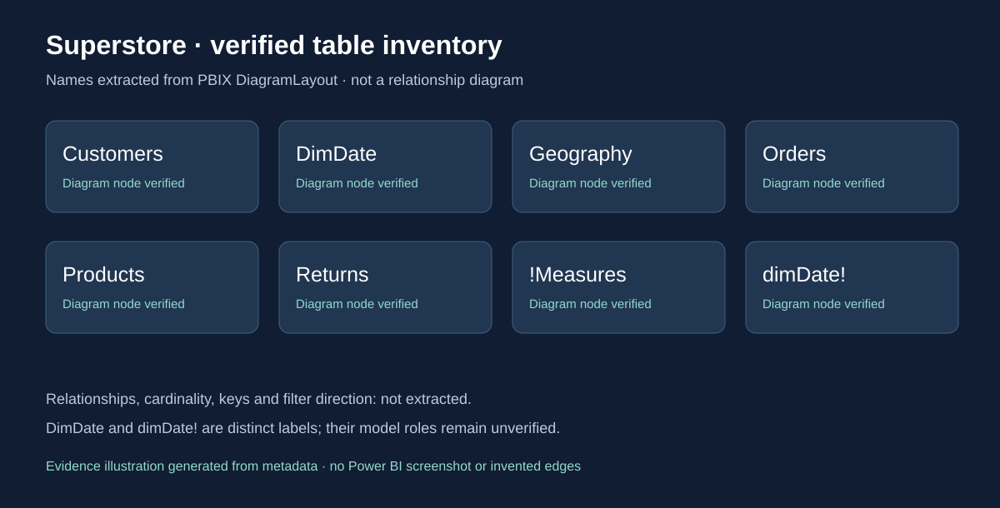

# Superstore Sales & Operations Analytics | Power BI

[Portfolio](../../README.md) · [Download PBIX](Project%204%20Analyze%20Data%20with%20Power%20BI%20Superstore%20%28Shachar%20Givon%29.pbix) · [Technical audit](AUDIT.md)

## Project Overview

A portfolio project organized around seven sales and operations reporting perspectives: executive performance, products, customers, geography, shipping, returns and growth. The report combines KPI cards, comparisons, hierarchies, maps and interactive controls to support business investigation.

**Verified scope:** seven report pages, 93 visual containers, 32 slicers, 21 referenced measure names and seven bookmark buttons. This case study explains the saved report design without requiring Power BI Desktop. Numeric results, DAX formulas and model relationships remain unverified; actual dashboard exports are still needed.

## Business Questions

- How are sales, profit and order economics changing over time?
- Which products combine sales with stronger or weaker profitability?
- How do customer segments differ in sales, profit and order activity?
- How does performance vary across regions, states and cities?
- How do order volume and shipping duration vary by ship mode?
- How do returned orders vary by product, location and return reason?
- How does current sales performance compare with prior periods and targets?

These questions describe investigations supported by the configured fields, not conclusions about the data.

## Dataset

The supplied Superstore PBIX contains a compressed data model and report definitions. The diagram names Orders, Customers, Products, Geography, Returns, DimDate, dimDate! and !Measures. The repository supplies no separate Superstore source dataset or verified refresh procedure. Source provenance, row grain, date coverage, currency, cleaning steps and record counts are not established by this audit.

## Data Model

This is an evidence illustration, not a Power BI screenshot or relationship diagram. Orders is a fact-table candidate; Customers, Products and Geography are dimension candidates. Their keys, relationships, cardinalities and filter directions could not be extracted. The two date-table labels are preserved separately. See [data model evidence](DATA-MODEL.md).

## Key Measures

| Business topic | Exact verified measure references |
| --- | --- |
| Sales and profitability | `Total_Sales`, `Total_Profit`, `Profit_Margin_%`, `Total_Quantity` |
| Orders and customers | `Count_Orders`, `Count_Customers`, `Average_Order_Value`, `Orders_per_Customer` |
| Time comparisons | `Sales_Previous_Year`, `Sales_YoY_%`, `Running _Total_Sales` |
| Operations | `Average_Shipping_Days`, `Return_Rate_%`, `Returned_Orders`, `Returned_Sales` |
| Target comparison | `Sales_Target`, `Sales_Gauge_Max` |

These are names verified in Measure expressions, not reconstructed formulas. [All 21 references and requested-concept coverage](MEASURES.md) include unresolved items such as Average Discount and standalone Shipping Days.

## Report Pages

| Page | Business investigation | Configured evidence |
| --- | --- | --- |
| Sales Overview | Overall performance and period comparisons | KPI cards, sales target gauge, sales by segment/category, prior-year and cumulative trends |
| Product Analysis | Sales versus product profitability | Category/subcategory columns, product rankings, detailed matrix |
| Customer Analysis | Segment contribution and customer activity | Segment charts, customer rankings and hierarchy matrix |
| Regional Analysis | Geographic performance | State shape map, regional comparisons, state/city rankings and hierarchy matrix |
| Shipping & Operations | Shipping duration and order mix | Ship-mode comparisons, duration trend and operations matrix |
| Returns | Return patterns and reasons | Return KPIs, reason breakdown, state map and return-rate trend |
| Growth & Trends | Growth, historical comparison and trend exploration | YoY, prior-year and running-total visuals, target KPI and two forecast configurations |

[Page-by-page guide](REPORT-PAGES.md) documents questions, KPIs, visuals, slicers, interaction overrides and evidence IDs for every page. The primary PBIX has no `Page 1`; that earlier listing came from the retained archive.

## Key Findings

The audit supports conclusions about **report design**: coverage spans commercial and operational topics; year/region/category/segment slicers recur across pages; rankings, geographic views and prior-period bindings support comparative analysis.

No numeric business finding is asserted. Highest-performing products, loss-making locations, return causes, shipping improvements and forecast outcomes require visible report evidence with recorded filters. A configured chart alone does not establish a result or business impact.

## Dashboard Preview

Actual dashboard screenshots are not yet available. The PBIX contains themes and map topology but no dashboard preview image, and Power BI pages could not be rendered in this environment. The table inventory above is clearly labeled metadata documentation.

Follow the [seven-page screenshot export checklist](assets/README.md) to add genuine previews. It specifies filenames, capture priorities, model-view evidence and filter-context requirements.

## Power BI Techniques Demonstrated

- KPI-oriented page construction and measure bindings across sales, customer, return and shipping topics.
- Multi-page reporting with cards, charts, matrices, a target gauge and geographic shape maps.
- Time-series and prior-period comparison bindings, with two saved forecast configurations.
- Customer/product/geographic hierarchy bindings and TopN ranking filters.
- Interactive design through 32 slicers, explicit filter/highlight/no-filter overrides, and seven bookmark-linked reset buttons.

DAX implementation, relationship design, drill-through destinations, runtime reset behavior and forecast accuracy are not claimed as validated capabilities. This is a portfolio project, not client work.

## Limitations

Model metadata extraction was blocked by Windows Application Control when loading a parser dependency. DAX bodies, calculated columns, relationships and date-table designation remain unavailable. Source data, refresh and rendered values were not validated. Complete the Desktop checks in the [audit](AUDIT.md) before adding quantitative findings or claiming tested navigation.

## Files

| File | Purpose |
| --- | --- |
| [Primary PBIX](Project%204%20Analyze%20Data%20with%20Power%20BI%20Superstore%20%28Shachar%20Givon%29.pbix) | Original report, unchanged |
| [README](README.md) | Recruiter-facing case study |
| [Audit](AUDIT.md) | Evidence levels, source hash, configuration details and limitations |
| [Data model](DATA-MODEL.md) | Verified nodes and explicitly inferred roles |
| [Measures](MEASURES.md) | Exact references; no invented DAX |
| [Report pages](REPORT-PAGES.md) | Detailed guide to all seven pages |
| [Report structure](report-structure.json) | Machine-readable extraction with source member paths |
| [Assets and export checklist](assets/README.md) | Genuine screenshot capture requirements |
| [Quality control](QUALITY-CONTROL.md) | Completed checks and remaining runtime validation |
| [Extraction script](scripts/extract_report.py) | Reproduce report evidence without changing the PBIX |

The earlier `.pbix.zip` is retained unchanged for historical compatibility and is not the source for this case study.
