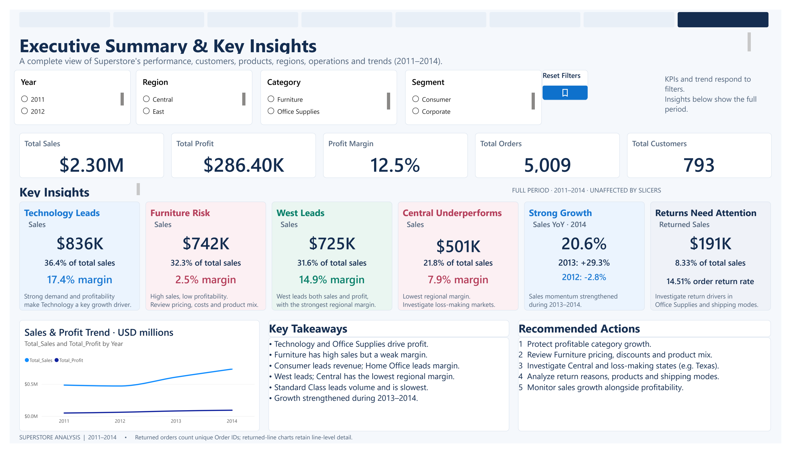
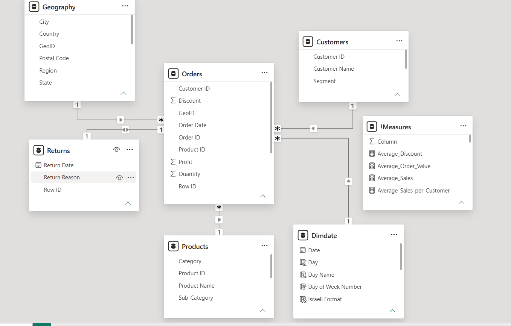
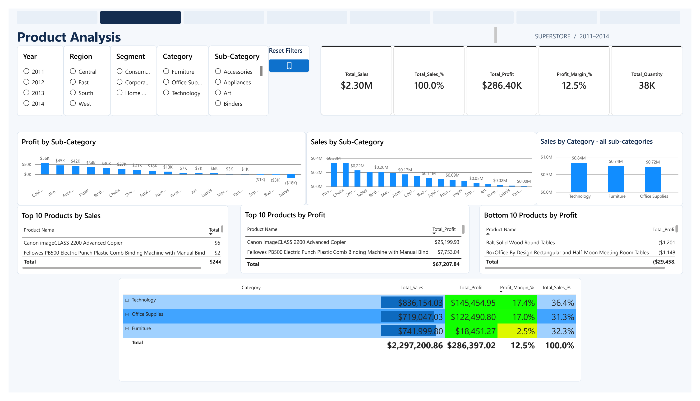

# Superstore Sales & Operations Analytics | Power BI

[Final PBIX](Project%204%20Analyze%20Data%20with%20Power%20BI%20Superstore%20%28Shachar%20Givon%29.pbix) · [Original report PDF](final-report.pdf) · [Portfolio](../../README.md)

## Executive Summary

For **2011–2014**, the exported report shows **$2.30M sales, $286.40K profit, 12.5% margin, 5,009 orders and 793 customers**. Technology combines substantial revenue with stronger profitability; Furniture has high sales but a weak margin. West leads regional sales and margin, while Central warrants closer investigation. Growth rebounded after 2012, and returns represent a material area for review.

These are displayed report results, verified against the supplied PDF, rather than an independent recalculation of the semantic model. Recommendations describe next investigations, not implemented changes or proven causes.

## Dashboard Preview

Original dashboard appearance, rendered losslessly from PDF page 8. Executive insights are explicitly labeled **full period, unaffected by slicers**; upper KPIs and the trend are labeled filter-responsive. [All eight dashboards](REPORT-PAGES.md) are available without Power BI Desktop.

## Business Objectives

Identify profitable category and regional growth, compare customer segments, monitor year-over-year performance, and distinguish shipping activity, returned orders and returned lines. Use the executive view to prioritize follow-up analysis.

## Dataset & Data Preparation

The supplied Superstore report describes sales and operations during 2011–2014 in USD. The model screenshot shows Orders, Customers, Products, Geography, Returns, Dimdate and !Measures. Orders is the central transaction table; visible Row ID fields in Orders and Returns support investigating line-level linkage.

Separate subject tables, date fields and calculated-column icons are visible. Source provenance, row counts, raw files, Power Query transformations and exact cleaning/refresh steps are not supplied; no specific preparation workflow is claimed as verified.

## Data Model

Customers, Products, Geography and Dimdate each have visible **1-to-many, single-direction** relationships into Orders. Orders and Returns have a visible **1-to-1, bidirectional** relationship. !Measures has no visible relationship line. Relationship keys are not exposed by this screenshot. [Model evidence and return-filter implications](DATA-MODEL.md) distinguish visible facts from inferred design choices.

## Key KPIs

Context: exported full-period baseline, 2011–2014; visible slicer options are unselected. Hidden filter state is not proven by a PDF.

| KPI | Report value | Evidence |
| --- | --- | --- |
| Total Sales | $2,297,200.86 | Detail matrix, PDF pages 2–5; executive card rounds to $2.30M |
| Total Profit | $286,397.02 | Detail matrix, PDF pages 2–5; executive card rounds to $286.40K |
| Profit Margin | 12.5% | Executive Summary, page 8 |
| Total Orders / Customers | 5,009 / 793 | Executive Summary, page 8 |
| Returned Sales | Approximately $191K | Executive Summary; page 6 shows $191.38K |
| Returned Sales Share | 8.33% | Pages 6 and 8 |
| Order Return Rate | 14.51% | Page 8; page 6 rounds to 14.5% |

The Returns page separately displays **727 returned orders and 800 returned lines**. Its footer states unique Order IDs for orders and line detail for breakdowns. The original DAX remains unavailable.

## Business Insights

- **Technology:** approximately $836K sales, 36.4% share and 17.4% margin. Investigate opportunities to sustain profitable growth.
- **Furniture:** approximately $742K sales but 2.5% margin. Review pricing, discounts, product mix and costs.
- **Regions:** West shows approximately $725K sales and 14.9% margin; Central approximately $501K and 7.9%. Compare underlying products, discounts and markets before attributing causes.
- **Growth:** YoY was -2.8% in 2012, +29.3% in 2013 and +20.6% in 2014. Investigate the category/customer mix behind the rebound.
- **Returns:** approximately $191K returned sales, 8.33% sales share and 14.51% order return rate. Investigate reasons and line-level patterns without treating line counts as order counts.
- **Shipping:** Standard Class represents 59.8% of displayed order share and averages 5.01 shipping days, labeled line-weighted. Review service expectations and volume mix; shipping mode is not established as a cause of returns.

[Detailed insights](BUSINESS-INSIGHTS.md) record the question, evidence, interpretation and proposed next investigation for each finding.

## Dashboard Pages

| Page | Analytical purpose |
| --- | --- |
| [Executive Summary & Key Insights](REPORT-PAGES.md#executive-summary--key-insights) | Full-period priorities, KPIs and recommended actions; PDF page 8 |
| [Sales Overview](REPORT-PAGES.md#sales-overview) | Sales economics, targets and historical comparisons |
| [Product Analysis](REPORT-PAGES.md#product-analysis) | Category/subcategory profitability and product rankings |
| [Customer Analysis](REPORT-PAGES.md#customer-analysis) | Segment contribution and customer activity |
| [Regional Analysis](REPORT-PAGES.md#regional-analysis) | Regional margins and state/city comparisons |
| [Shipping & Operations](REPORT-PAGES.md#shipping--operations) | Shipping mix and line-weighted duration |
| [Returns](REPORT-PAGES.md#returns) | Order-level KPIs and line-level breakdowns |
| [Growth & Trends](REPORT-PAGES.md#growth--trends) | Prior-year comparisons, YoY, cumulative sales and forecasts |

## Power BI Techniques

Verified evidence demonstrates relationship modeling, measure-bound KPI cards, customer segmentation, profitability comparisons, geographic maps, hierarchy matrices, conditional formatting, prior-year/YoY/running-total reporting and rendered forecast bands. The PBIX configures 36 slicers, 64 page-navigation actions and eight reset-bookmark actions; destinations resolve, but runtime clicks are not tested. [Measure references](MEASURES.md) document analytical purposes without invented DAX. Power Query steps and drill-through destinations are unverified.

## Technical Challenges & Solutions

- **Returns granularity:** separate order counts from line breakdowns. Shared Row ID fields are visible, but the actual join endpoints and formula denominators still need export; bidirectional filtering can alter the population used by a return measure.
- **Filter context:** the executive page explicitly separates dynamic KPIs/trend from fixed full-period insight cards. Saved NoFilter overrides support this design; original DAX and live behavior need review.
- **Time analysis:** previous-year, YoY, cumulative and forecast views provide complementary comparisons; individual card blanks and mixed date query aliases remain documented review points.
- **Visual choice:** columns compare categories/margins, pies show segment/region shares, maps locate geographic differences, lines show time patterns, and executive cards combine metrics with concise recommendations. Export defects are retained rather than retouched.

## Limitations

Visual evidence verifies what the report displays, not independent analytical correctness. Original DAX, relationship keys/properties, transformations and refresh remain unverified. The PDF contains clipped values, blank navigation labels and overlapping Returns slicers; the Sales Overview gauge displays a $2.06M maximum below $2.30M sales. [Rendered evidence and review issues](RENDERED-EVIDENCE.md) preserve these observations and rounding differences without silently correcting the approved report.

## Project Files

| File | Purpose |
| --- | --- |
| [Final PBIX](Project%204%20Analyze%20Data%20with%20Power%20BI%20Superstore%20%28Shachar%20Givon%29.pbix) / [PDF](final-report.pdf) | Authoritative implementation and authentic rendered report |
| [Dashboard/model assets](assets/README.md) | Eight PNGs, original model screenshot and provenance |
| [Page guide](REPORT-PAGES.md) / [Business insights](BUSINESS-INSIGHTS.md) | Complete page coverage and supported findings |
| [Model](DATA-MODEL.md) / [Measures](MEASURES.md) | Visible relationships, reference inventory and evidence limits |
| [Rendered evidence](RENDERED-EVIDENCE.md) / [Audit](AUDIT.md) / [Quality control](QUALITY-CONTROL.md) | Values, hashes, checks and remaining work |
| [PBIX extraction](report-structure.json) / [PDF extractor](scripts/extract_pdf_pages.py) | Reproducible technical evidence and genuine PNG rendering |
| [Previous PBIX archive](archive/README.md) | Prior version preserved; not used for current findings |

The final PBIX and historical ZIP remain byte-for-byte unchanged by this visual/documentation upgrade.
