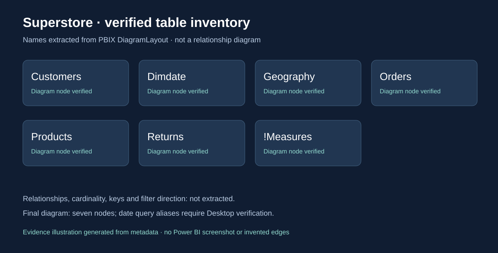

# Superstore Sales & Operations Analytics | Power BI

[Portfolio](../../README.md) · [Download final PBIX](Project%204%20Analyze%20Data%20with%20Power%20BI%20Superstore%20%28Shachar%20Givon%29.pbix) · [Technical audit](AUDIT.md) · [Previous version archive](archive/README.md)

## Project overview

The final, approved and submitted Project 4 report examines commercial performance and operations through eight pages, ending with **Executive Summary & Key Insights**. It brings sales, profitability, customers, products, geography, shipping, returns and growth into one report, with an executive narrative and recommended actions.

Verified saved structure: **eight pages, 228 visual containers, 36 slicers, 45 distinct referenced measure names, 64 page-navigation actions and eight bookmark reset actions**. Containers include decorative text and controls. The attached final PBIX is the authoritative source, copied unchanged; the previous primary is archived byte-for-byte. Original analytical results and definitions remain inside these preserved artifacts.

## Methodology

The report's configured analytical approach combines KPI summaries with category/customer/geographic comparisons, hierarchy matrices, TopN rankings, shipping-duration views, returned-order and returned-line analysis, prior-year comparisons, cumulative sales, targets and two saved forecast configurations. The executive page combines filter-responsive KPIs/trend with separately labeled full-period insights. These are verified design features; formula implementation and runtime behavior require model/rendered evidence.

For this documentation, the final PBIX was read as a ZIP package without saving, refreshing or editing it. JSON page, visual and bookmark definitions were parsed, source text and field bindings preserved, and package CRC and SHA-256 integrity checked. [The extractor](scripts/extract_report.py) reproduces the [evidence JSON](report-structure.json) with a final-source hash guard.

Source data provenance, Power Query transformations, cleaning steps, row counts, refresh paths, currency and evaluated date coverage have not been verified. The saved executive narrative describes **2011–2014**; this is an author-provided period label rather than a recalculated model range.

## Business questions and pages

| Saved order / page | Business question | Configured analysis |
| --- | --- | --- |
| 1. Sales Overview | How do sales, profit and order economics change over time? | KPI cards, target gauge, segment/category sales, prior-year and cumulative comparisons |
| 2. Product Analysis | Which products combine revenue with stronger or weaker profitability? | Category/subcategory charts, TopN product tables and hierarchy matrix |
| 3. Customer Analysis | How do segments differ in sales, margins and customer activity? | Segment comparisons, customer rankings, hierarchy and orders per customer |
| 4. Regional Analysis | Where do sales and profitability differ? | Region comparisons, state shape map, state/city rankings and hierarchy matrix |
| 5. Shipping & Operations | How do order mix and shipping duration vary by ship mode? | Orders, profit, shipping-duration comparisons and operations matrix |
| 6. Returns | How do returned orders and returned lines vary by product, geography and reason? | Return KPIs, returned-line breakdowns, reason chart, state map and trend |
| 7. Growth & Trends | How do current results compare with prior periods and targets? | YoY, prior-year, cumulative, profit and target views; two forecast configurations |
| 8. Executive Summary & Key Insights | Which full-period findings and actions merit attention? | 23 executive cards, sales trend, four slicers, original insights/takeaways/actions |

[The complete page guide](REPORT-PAGES.md) records every analytical visual, binding, evidence ID, slicer and interaction count, including original executive text. All eight pages have eight page-navigation buttons and one reset action; every saved destination exists, while execution remains a Desktop check.

## KPIs and measure evidence

| Topic | Exact referenced measure names |
| --- | --- |
| Revenue and profitability | `Total_Sales`, `Total_Profit`, `Profit_Margin_%`, `Total_Quantity`, `Total_Sales_%` |
| Orders and customers | `Count_Orders`, `Count_Customers`, `Average_Order_Value`, `Average_Sales_per_Customer`, `Orders_per_Customer` |
| Time and targets | `Sales_Previous_Year`, `Sales_YoY_%`, `Running_Total_Sales`, `Sales_Target`, `Sales_Gauge_Max` |
| Operations and returns | `Average_Shipping_Days`, `Count_Orders_%`, `Return_Rate_%`, `Returned_Orders`, `Returned_Lines`, `Returned_Sales`, `Returned_Sales_%` |
| Executive summary | 23 `ES_*` references covering sales, profit, margin, orders, customers, category/region contributions, growth context and returns |

[All 45 references](MEASURES.md) are verified as names in Measure expressions, not as original DAX bodies or a complete model inventory. The saved `.dax` query is empty. No formula, return denominator, target logic, numerical KPI or context-removal implementation has been reconstructed from names.

## Supported findings

The following qualitative takeaways are **present in the approved report's saved executive narrative**. Their presence is verified; they have not been independently recalculated or checked against rendered values. They describe the author's full-period analysis, not conclusions that automatically hold under every slicer selection.

| Saved takeaway / action | Executive Summary textbox evidence |
| --- | --- |
| Technology and Office Supplies drive profit; Technology is presented as a growth driver. | `41736f014d2946e7876b`, `48c63e3a874547dea2bc` |
| Furniture combines high sales with weak margin; review pricing, costs, discounts and product mix. | `41736f014d2946e7876b`, `24d38108b6954d18bea3`, `a7c3001299bb4b8fb6a8` |
| Consumer leads revenue while Home Office leads margin. | `41736f014d2946e7876b` |
| West leads sales and profit and has the strongest regional margin; Central has the lowest regional margin. | `599bfb4dc7164e0b9934`, `d86bf5cfd5b043fdb612`, `41736f014d2946e7876b` |
| Standard Class leads volume and is slowest. | `41736f014d2946e7876b` |
| Growth strengthened during 2013–2014; monitor growth alongside profitability. | `95c06a33ffb4419c9bc1`, `41736f014d2946e7876b`, `a7c3001299bb4b8fb6a8` |
| Investigate return drivers in Office Supplies and shipping modes, and review return reasons/products. | `28350f9cd8fb4c4fb09b`, `a7c3001299bb4b8fb6a8` |
| Investigate Central and loss-making states, with Texas given as an example. | Original actions `a7c3001299bb4b8fb6a8` |

Recommendations above are saved project content, not actions carried out by this documentation update. No business impact, numerical amount or forecast outcome is claimed. Publish numeric support only after a genuine screenshot or evaluated export records values, units, period and complete filters. [Original narrative and evidence IDs](REPORT-PAGES.md#executive-summary--key-insights) preserve the author's findings without adding results.

## Data model and limitations

The illustration shows seven final diagram nodes and no invented relationship edges. It is metadata documentation, not a dashboard screenshot. Product Analysis uses `Dimdate.Year`, while other pages retain `dimDate!` date-hierarchy query references; those labels require model verification. See [data model evidence](DATA-MODEL.md).

Relationship endpoints, cardinality, filter direction, active state, original DAX, calculated columns, date-table designation and transformations remain unavailable from the parsed metadata. Rendering, refresh, navigation/reset behavior, filter propagation and forecasts were not executed. The author's distinction between unique returned orders and returned-line detail is documented as narrative intent; the original formula semantics still need export.

## Genuine dashboard exports

No raster dashboard screenshots are available in the package, and none have been fabricated. Follow the [eight-page export checklist](assets/README.md), including Executive Summary, model-view evidence and original formula/relationship metadata. The checklist also covers filter-responsive KPIs versus full-period insight cards.

## Project files

| File | Purpose |
| --- | --- |
| [Final PBIX](Project%204%20Analyze%20Data%20with%20Power%20BI%20Superstore%20%28Shachar%20Givon%29.pbix) | Authoritative approved report, unchanged from the attachment |
| [Previous version archive](archive/README.md) | Former primary PBIX and provenance |
| [Audit](AUDIT.md) | Source hashes, evidence levels, preservation and limits |
| [Report pages](REPORT-PAGES.md) | All eight pages and original narrative |
| [Measures](MEASURES.md) | 45 exact references and DAX extraction status |
| [Data model](DATA-MODEL.md) | Final diagram nodes and relationship evidence limits |
| [Report structure](report-structure.json) | Reproducible source definitions |
| [Extraction script](scripts/extract_report.py) | Read-only PBIX extraction with integrity guards |
| [Export checklist](assets/README.md) | Required genuine screenshots and model exports |
| [Quality control](QUALITY-CONTROL.md) | Completed checks and remaining manual work |

The original historical `.pbix.zip` is retained at its existing path for compatibility; it is not the final source.
