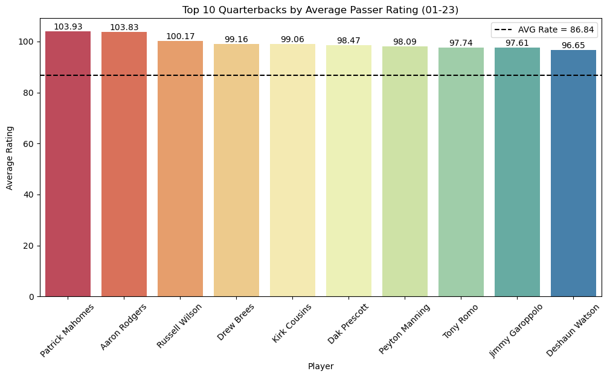
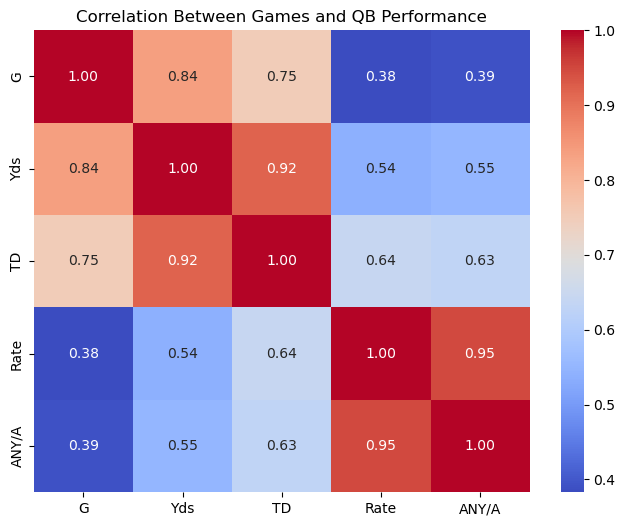

# NFL Quarterback Performance Analysis – Python

[Portfolio](../../README.md) · [Notebook](Project%203%20NFL%20Passing%20Statistics%20Analysis%20%28Shachar%20Givon%29%20.ipynb) · [Dataset](Project%203%20NFL%20Passing%20Statistics%20Analysis%20%28Shachar%20Givon%29.xlsx) · [Bilingual data dictionary](project%203%20-%20Table%20explanation%20%28Shachar%20Givon%29.xlsx)

**Deliverable:** an exploratory notebook, Excel dataset and Hebrew/English field guide covering NFL passing performance and contract comparisons.

## Business / Research Question

How do passing performance, production and efficiency vary across seasons, teams, players, age groups and contract values?

## Dataset

The supplied workbook's `NFL_Data` sheet contains **2,246 records and 36 columns**, covering **2001–2023**, with no duplicate Player/Year pairs found in this review. It includes passing and sack metrics, age, league-entry dates and contract fields. The population contains passing players, not exclusively verified quarterbacks.

The workbook also includes six audit/summary sheets. These record earlier enrichment and correction steps; some retain counts from a 2,350-row version and do not reconcile with the current sheet. Source labels include OverTheCap contract history and **2026 Spotrac rookie-scale estimates applied to historical records**. Source labels are retained as supplied and have not been independently verified.

The separate dictionary explains 31 fields in Hebrew and English. It predates the contract additions and calls the season-length field `Season_Games`, while the dataset uses `Games_In_Season`.

## Tools

Python, pandas, NumPy, Matplotlib and Seaborn; Excel workbooks provide input data and documentation. The notebook imports pyodbc and pandasql but does not demonstrate a database connection or SQL execution. SQL Server/pyodbc are demonstrated in the separate [Northwind project](../northwind-analysis/README.md).

## Data Preparation

- Load the workbook with `pandas.read_excel`, inspect types, shape and missing values.
- Convert birth and league-entry dates, derive years in the league and career-stage groups.
- Fill separate estimated contract columns with year-specific medians and flag originally missing contract values.
- Apply analysis-specific participation filters, group and merge data, and construct career summaries.

Contract analysis later uses `Contract_APY`, not the median-filled `Contract_APY_Estimated`. The original APY field already includes some rookie-scale estimates, so it must not be described as entirely observed historical salary.

## Analysis

| Theme | Implemented method |
| --- | --- |
| Season trends | Grouped annual means and totals; line charts |
| Team comparison | Player/team groups with at least five qualifying records |
| Career rankings | At least five qualifying seasons; production and efficiency metrics |
| Composite scoring | Weighted metrics, then normalization by each metric's maximum |
| Age and experience | Age-group summaries and career-stage derivation |
| Playing volume | Correlations and regression plots |
| Contract value | APY comparisons, correlations, NumPy linear fit and residual rankings |

## Key Metrics

Passer rating, completion percentage and ANY/A are averaged across qualifying records, rather than recomputed from pooled attempts. Touchdowns are summed. TD per game is total TD divided by total games in the selected records.

The normalized QB Score combines rating (25%), ANY/A (25%), NY/A (15%), completion percentage (15%), TD (10%) and TD/game (10%) after scaling each by its selected-sample maximum. These are exploratory choices, not a validated player-rating system.

Two different value measures are explored: ANY/A per APY million, and actual ANY/A minus a fitted salary-based expectation. Contract APY is not realized annual pay, and neither measure establishes financial return on investment.

## Key Insights

The following observations were checked against saved outputs and independently recalculated from the supplied workbook using the same relevant filters. They describe this sample, not full career records or causal effects.

- With `G > 5`, `Att > 30` and at least five qualifying seasons, Patrick Mahomes leads the mean passer-rating table at **103.93**, narrowly ahead of Aaron Rodgers at **103.83** (cell 75).
- Tom Brady leads the selected touchdown totals with **599**, while Mahomes leads TD/game at **2.31** (cells 79 and 83). Cumulative production and production rates yield different rankings.
- With `G > 5` and `Att > 10`, games played correlate more strongly with yards (**0.838**) than with passer rating (**0.383**) (cell 156). Association does not establish that playing more games improves ability.

Cell references count all 198 notebook cells from the top.

## Visualizations

*Unmodified saved chart from cell 77. The filters and averaging method above apply.*

*Unmodified saved chart from cell 158.*

## Technical Skills Demonstrated

DataFrame inspection, missing-value assessment, datetime conversion, derived columns, median imputation, filtering, groupby/aggregation, merges, ranking, normalization, correlation analysis, NumPy linear fitting and Matplotlib/Seaborn visualizations.

## Reproducibility and Review Findings

Download the notebook and dataset into the same directory and launch Jupyter there. The notebook reads the dataset by its original filename. It imports pandas, NumPy, Seaborn, Matplotlib, pyodbc and pandasql; reading XLSX also requires a compatible Excel reader such as openpyxl. Package versions are not supplied. The 23 MB notebook may be easier to inspect locally than in GitHub's preview.

The full notebook was not rerun. Original code and outputs are preserved. Before relying on all conclusions:
- Cells 31, 34, 37, 40, 43, 46 and 49 combine a `season_stats` mask with a `df` mask. Index alignment invalidates the intended decade selection.
- Some narrative comments disagree with current outputs: cell 78 names Rodgers first, while cell 75 and its chart place Mahomes first.
- Cell 111 draws its benchmark at the old unnormalized mean while labeling the normalized mean.
- Cell 171 labels the x-axis signing year but plots season `Year`.
- Reconcile workbook audit counts, validate player identities and distinguish observed contracts from 2026-based estimates before drawing salary conclusions.
- Filters based on games/attempts do not verify player position. Team associations, age patterns and salary correlations do not establish causation.
