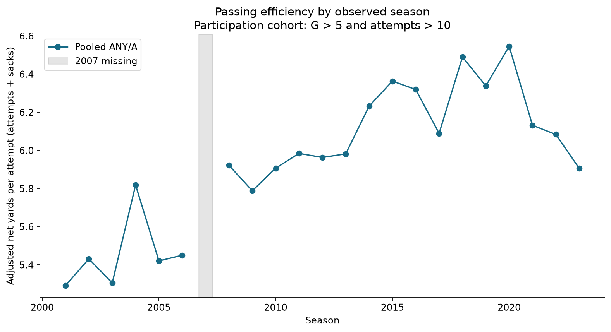
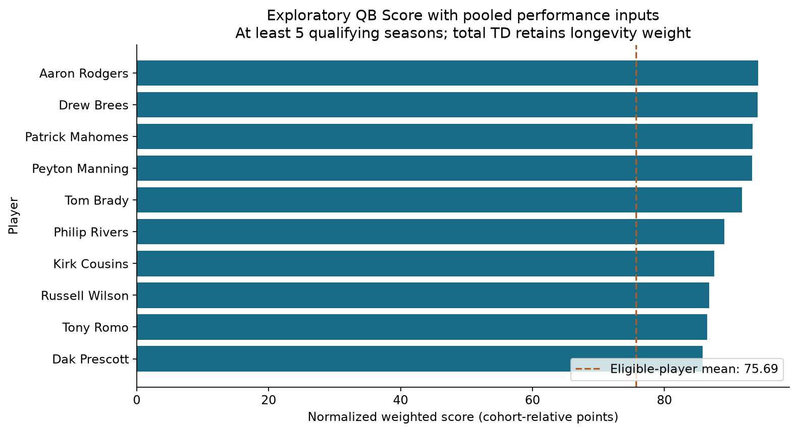
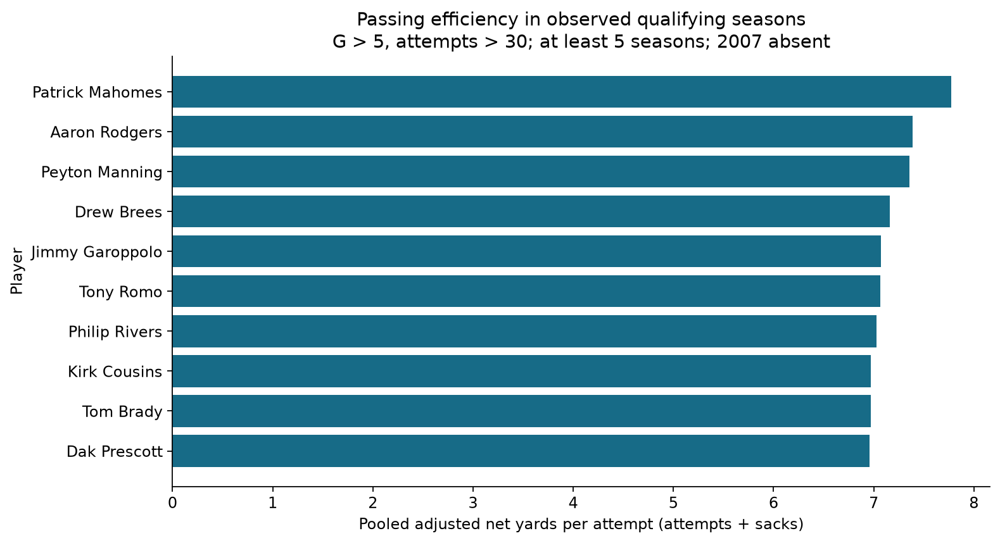
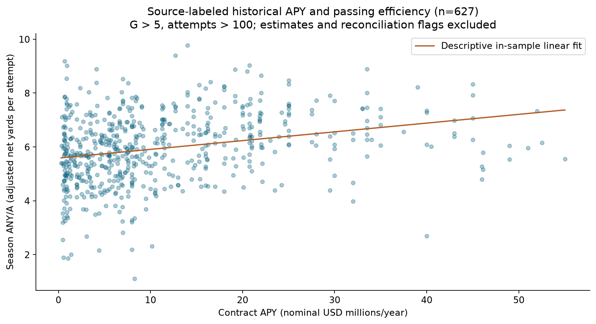

# NFL Quarterback Performance Analysis

[Corrected notebook](nfl-quarterback-analysis-corrected.ipynb) · [Full audit](AUDIT.md) · [198-cell review](cell-audit.csv) · [Original notebook](Project%203%20NFL%20Passing%20Statistics%20Analysis%20%28Shachar%20Givon%29%20.ipynb)

Python portfolio project demonstrating data validation, reproducible aggregation, cohort definitions, analytical auditing and communication of uncertainty. Original notebook and XLSX inputs are preserved for comparison.

## Business / Research Questions

- How do passing production and efficiency differ across players and observed seasons?
- How do pooled career rates differ from equally weighted season averages?
- How sensitive is a custom QB Score to eligibility and overlapping metrics?
- What descriptive relationship exists between source-labeled historical contract APY and passing efficiency?

## Dataset

The supplied NFL_Data sheet has **2,246 rows, 36 columns, 22 seasons spanning 2001–2023, with 2007 entirely missing**, and no duplicate Player/Year keys. These are passing players; a position column is unavailable. Career comparisons cover available qualifying seasons, not complete careers.

The bilingual dictionary defines 31 fields. Six workbook audit/summary sheets describe earlier corrections and enrichment; old 2,350-row counts do not describe the current data. Current checks flag **51 birth-date/age inconsistencies** and **1,689 fractional `1D` values** inconsistent with a count definition. Neither is silently repaired. Multi-team player-season totals remain in player analyses but are excluded from team attribution.

Contract provenance: **1,082 source-labeled historical rows, 222 Spotrac 2026 rookie-scale estimates, and 942 missing rows**. Source attribution is inherited and not independently verified record by record. Each of the five contract fields has 942 missing observations. The historical and estimated rows are never pooled in the corrected contract results.

## Tools

Python, pandas, NumPy, Matplotlib, openpyxl (read-only XLSX access), IPython/Jupyter. No database connection is needed. The analysis demonstrates Python use of Excel inputs, not Excel modeling.

## Data Preparation

Explicit sheet loading, date parsing, key and duplicate checks, missingness by field and contract provenance, annual coverage, impossible-value checks, ratio reconciliation and validated merge cardinality. Source XLSX hashes are checked after execution. Negative passing yards or ANY/A and trade-related games above a team schedule are review flags rather than automatically deleted records.

Participation choices are distinct from data-quality fixes:

|Analysis|Eligibility|
|---|---|
|Season trends and playing-volume correlations|G > 5 and Att > 10|
|Career and efficiency|G > 5 and Att > 30; at least 5 qualifying observed seasons|
|Age summaries|GS ≥ 5|
|Contract relationship|G > 5 and Att > 100; source-labeled historical, positive, active interval and APY reconciliation|

These filters do not establish player position. Sensitivity tables compare attempt thresholds and 3/5/7-season eligibility.

## Methodology

Pooled rates derive from summed underlying counts, while equal-season averages remain available for comparison. All era masks use the same DataFrame being filtered; the missing season appears as a gap. Team and age summaries are descriptive and subject to survivorship selection.

The original normalized QB Score retains its weights: rating 25%, ANY/A 25%, NY/A 15%, completion percentage 15%, total TD 10%, TD/game 10%. Each corrected pooled input is divided by its eligible-cohort maximum and multiplied by 100. Higher is better for every input. Total TD retains a longevity preference. This is a subjective index with conceptually overlapping inputs, not a validated player-rating model. Metric correlations and leave-one-component-out ranks expose sensitivity. The raw-unit QB Score and separate raw-unit Efficiency Score are retired.

Contract APY is average contract value per year, not annual salary paid, cap charge or ROI. Historical rows are checked against signing year and length; 32 source rows fail APY ≈ value/length within $1/year. Main analysis conservatively excludes them, with an inclusion sensitivity table. Signing-year summaries use actual signing year and deduplicated contract tuples. Fitted residuals are explicitly in-sample descriptions; no significance tests, causal effects or out-of-sample predictions are claimed.

## Key Metrics

|Metric|Definition and interpretation|
|---|---|
|Completion %|100 × completions / attempts|
|ANY/A|(yards + 20 × TD − 45 × interceptions − sack yards) / (attempts + sacks)|
|NY/A|(yards − sack yards) / (attempts + sacks)|
|Passer rating|Standard four-component formula, each component clipped to [0, 2.375], recomputed from pooled counts|
|TD and TD/game|Observed qualifying-season touchdowns; divide by games from the same rows for the rate|
|QB Score|Cohort-relative normalized weighted index; not a percentile|
|APY|Nominal average contract value in USD/year|

Definitions checked against the [Pro Football Reference glossary](https://www.pro-football-reference.com/about/glossary.htm) and [Pro Football Hall of Fame](https://www.profootballhof.com/news/nfl-s-passer-rating).

## Analysis

The corrected notebook contains the 11 project sections from objective and validation through career, efficiency, era, score, contracts, findings and limitations. [AUDIT.md](AUDIT.md) documents 28 grouped issues, existing logic, problems, corrections and finding impacts. [cell-audit.csv](cell-audit.csv) accounts for every original cell. [Tables](tables/) contain current controls and comparison results.

Notable corrections include the cross-DataFrame decade masks, incorrect normalized-score benchmark, stale ranking claims, mislabeled axes, inconsistent contract cohorts, and separation of historical and estimated contracts. The original team merge did not duplicate rows; it now includes an explicit many-to-one assertion. The mixed-Series correlation in original cell 157 happened to align correctly and is documented as fragile rather than falsely reported as a numerical error.

## Key Findings

- The workbook contains 2,246 records and 22 observed seasons; 2007 is missing.
- Aaron Rodgers leads pooled passer rating (103.81); Patrick Mahomes leads pooled ANY/A (7.77) among 75 eligible players.
- Tom Brady leads observed qualifying-season TD totals (599). These are incomplete career windows.
- Aaron Rodgers leads the retained exploratory normalized QB Score (94.23); weights and overlapping inputs limit interpretation.
- Pooled ANY/A is 5.59 in observed 2001–2010 seasons and 6.23 in 2011–2020. This is descriptive, with unequal coverage.
- Contract APY and ANY/A have Pearson r=0.272 across 627 reconciled source-labeled historical player-seasons. No significance or causal claim is made.

**What changed:** the original equal-season rating leader was Mahomes (103.93); the corrected pooled leader is Rodgers (103.81). The normalized QB Score still has Rodgers first, now 94.23. Brady remains first in qualifying TD totals. Corrected mean annual attempts per qualifying player are 350.30 in observed 2001–2010 seasons and 406.83 in 2011–2020; the original first-era mask included later years. Claims about an optimal age, team development, “best value” contracts, causal improvement and statistical significance are withdrawn. The main contract sample has 627 rows (139 players); including APY-reconciliation flags yields 653 rows and r=0.266 instead of 0.272.

## Visualizations

## Limitations

Missing 2007, partial career windows, absent position/player IDs, suspicious birth metadata and an ambiguous first-down field limit completeness. Passing metrics omit rushing, opponents, offensive line, scheme and game state. Participation and longevity filters select survivors. Team relocation codes are not harmonized; age results are cross-sectional, not within-player aging effects.

Score weights are subjective and overlapping. Historical contract labels are unverified, missing observations are nonrandom, effective signing dates are unavailable, and nominal APY is not adjusted for inflation or salary cap. Repeated players/contracts and same-season information prevent causal or predictive interpretations. Small ranking differences are not statistically established differences in ability.

## Repository Files

|File|Purpose|
|---|---|
|[nfl-quarterback-analysis-corrected.ipynb](nfl-quarterback-analysis-corrected.ipynb)|Executed corrected analysis with embedded tables/charts|
|Original named notebook|Unmodified comparison version|
|Original two XLSX files|Unmodified input and bilingual dictionary|
|[AUDIT.md](AUDIT.md), [cell-audit.csv](cell-audit.csv)|Issue register and all-cell coverage|
|[assets/](assets/)|Four recruiter-friendly PNG previews|
|[tables/](tables/)|Reproducible validation, cohort, sensitivity and result tables|
|[requirements.txt](requirements.txt)|Tested package versions|
|[verify_notebook.py](verify_notebook.py)|Fresh-process execution and notebook-format checks|

To reproduce, create a Python 3.12 environment, install `requirements.txt`, and run `python verify_notebook.py` from this directory. Alternatively, open the corrected notebook in Jupyter and run all cells from this directory or repository root. Execution regenerates tables and PNGs; it does not edit the XLSX sources or original notebook.
