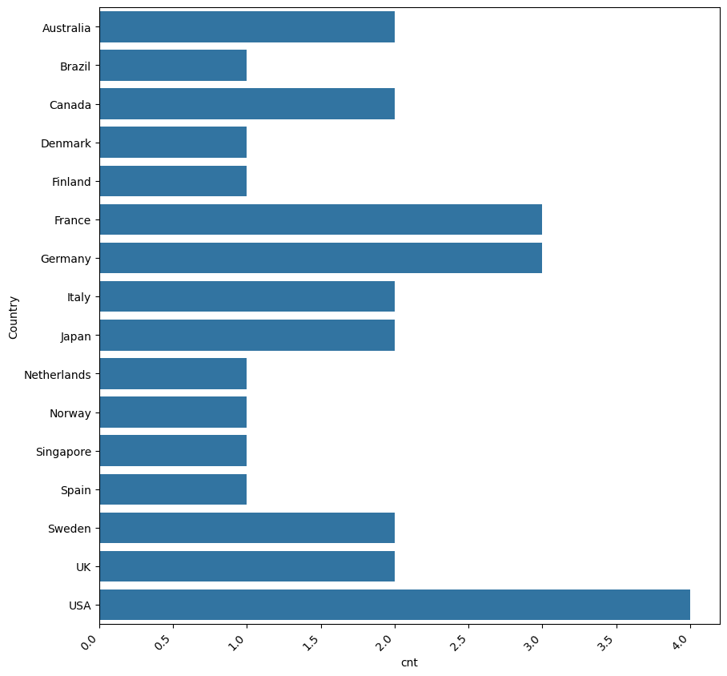

# Northwind SQL-to-Python Analysis

[Portfolio](../../README.md) · [Original notebook](../../pyodbc%20class.ipynb)

**Deliverable:** a learning notebook with SQL queries, pandas tables and eight saved chart outputs.

## Business / Research Question

Which customers have the highest sales value, where are suppliers and orders located, and how are products distributed across suppliers and categories?

## Dataset

The notebook connects to a local `NorthWind` SQL Server database and reads Orders, Order Details, Suppliers and Products. Saved outputs show 830 orders and 77 products. The database backup, data provenance and version are not included.

## Tools

Python, SQL / Microsoft SQL Server, pyodbc, pandas, Matplotlib and Seaborn in Jupyter. NumPy and pandasql are imported but are not used in the shown analysis, so they are not treated as demonstrated analytical capabilities.

## Data Preparation

A Windows trusted connection retrieves SQL results with `pandas.read_sql_query`. Queries filter customer IDs, join orders to order details and aggregate data by customer, country, supplier and category. pandas `value_counts()` also counts suppliers by country.

No explicit missing-value treatment, deduplication or broader cleaning workflow is demonstrated.

## Analysis

- Rank the top ten customers by unit price × quantity.
- Compare supplier counts by country.
- Compare order counts by shipping country.
- Count products by supplier and category.
- Calculate average product unit price by supplier.

## Key Metrics

| Metric | Definition |
| --- | --- |
| Customer sales value | `SUM(UnitPrice * Quantity)` by CustomerID, before discounts |
| Suppliers by country | Count of supplier rows grouped by Country |
| Orders by country | Count of order rows grouped by ShipCountry |
| Product assortment | Product count grouped by SupplierID and CategoryID |
| Average listed unit price | `AVG(UnitPrice)` by SupplierID, not sales-weighted |

## Key Insights

The following observations come from saved notebook outputs, not a fresh execution. Cell numbers count all cells from the top, including the raw exercise cell.

| Supported observation | Evidence |
| --- | --- |
| QUICK has the highest sales value in the saved top-ten table: 117,483.39, followed by SAVEA at 115,673.39 | Cell 11, `t10` output |
| USA has four suppliers; Germany and France have three each | Cells 13 and 15, `sup` and `value_counts()` outputs |
| Germany and USA tie for the highest order count, at 122 each | Cell 20, `ord` output |

Currency is not documented. Sales values exclude the discount field and should not be described as net revenue or profit. These are sample-database observations, not commercial impact.

## Visualizations

*Original saved output from cell 18; extracted without modification.*

Eight chart outputs are embedded in the original notebook:
- Cell 10: top-ten customer sales bar chart.
- Cells 16–18: supplier-country bar charts in different layouts.
- Cells 22–23: shipping-country order count charts.
- Cells 26 and 29: product counts by supplier/category.

These charts show the SQL-to-DataFrame-to-visualization workflow. The guide references the existing outputs without regenerating the analysis.

## Technical Skills Demonstrated

SQL joins and aggregations, Python database connectivity, DataFrame inspection, frequency counts, bar/count plots, categorical comparisons, chart sizing, tick-label rotation and bar labels.

## Review and Run Notes

Use Jupyter, a SQL Server instance containing Northwind, Windows authentication and a compatible ODBC driver. The connection currently specifies `localhost`, `NorthWind` and `SQL SERVER`; adapt these to the local setup.

The notebook imports pandas, pandasql, seaborn, matplotlib, numpy and pyodbc. Package versions are not recorded. Saved outputs include pandas connection warnings and Matplotlib tick-label warnings, so a clean run is still needed before claiming reproducibility.

This is Northwind analysis. It is separate from the NFL Python project, whose source files have not yet been shared.
