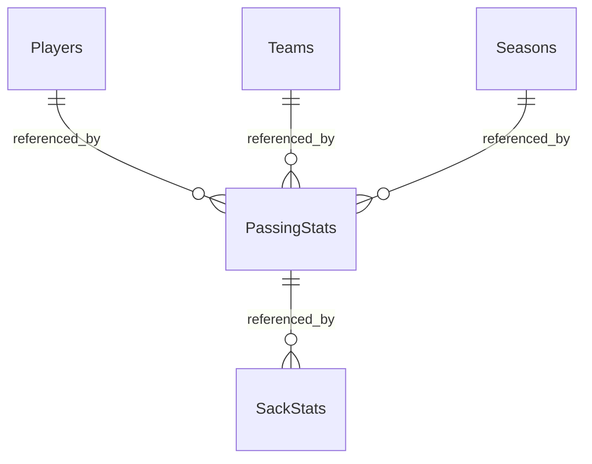

# NFL Quarterback Database – SQL Server

[Portfolio](../../README.md) · [Original SQL script](../../Project%201%20%E2%80%93%20Table%20Design%20%26%20Cretaion%20%28Shachar%20Givon%29.sql)

**Deliverable:** database/table definitions and loading queries for NFL passing statistics.

## Business / Research Question

How can NFL passing data be structured to support comparisons across players, teams and seasons?

## Dataset

The script expects an existing `NFL_Passing` table containing player identity, team, season, passing statistics and sack statistics. Source data, provenance, import steps and verified date coverage are not included.

The intended analytical grain links a player, team and season. Source uniqueness must be checked, including records for players associated with multiple teams.

## Tools

SQL / Microsoft SQL Server (T-SQL).

## Data Preparation

The script creates `NFL_Analysis` and five related tables, then uses `INSERT ... SELECT`, `DISTINCT` and joins to populate them from `NFL_Passing`. Players and passing/sack records are filtered using `Attempts > 10`; teams and seasons are loaded from the source without that filter.

The attempts threshold filters passing volume. It does not independently verify quarterback position.

## Analysis

The implemented work is relational modeling and data loading. Final `SELECT *` statements inspect the created tables; comparative performance analysis is not included.

| Table | Purpose and relationships |
| --- | --- |
| `Players` | Player identity, birth date and league entry date |
| `Teams` | Team identity and name |
| `Seasons` | Season year and games in the season |
| `PassingStats` | Passing metrics with foreign keys to Players, Teams and Seasons |
| `SackStats` | Sack and efficiency metrics with a foreign key to PassingStats |

## Key Metrics

Stored fields include attempts, completions, completion percentage, passing yards, touchdowns, interceptions, quarterback rating, sacks and adjusted net yards per attempt. The loading script copies these from the source; it does not calculate or validate their formulas.

## Key Insights

The design separates player, team and season attributes from performance records. No executed results or player rankings are supplied, so no performance conclusions are claimed.

## Visualizations

This diagram summarizes the foreign keys in the SQL source. As implemented, multiple sack records can reference one passing record; the intended one-to-one relationship is not enforced.

Foreign-key columns are nullable in the source; the diagram shows the relationships for populated keys.

## Technical Skills Demonstrated

Database and table creation, identity columns, primary/foreign keys, relational modeling, filtering, DISTINCT, joins and INSERT ... SELECT.

## Review and Run Notes

Use a disposable SQL Server environment. Run database creation separately, select the intended database and supply `NFL_Passing` before the source inspection or loading steps. Its required columns are visible in the original script.

Review these issues before an end-to-end run:
- Table definitions contain trailing commas that need syntax review.
- Player joins use names; duplicate names or inconsistent spelling may multiply or omit matches.
- `SackStats.PassingStatID` lacks a unique constraint for the intended one-to-one relationship.
- The player/team/season combination is not enforced as unique in `PassingStats`.
- The script has no rerun strategy; existing objects or repeated inserts can cause failures or duplicates.

The original analysis is preserved and has not been executed during this documentation review.
